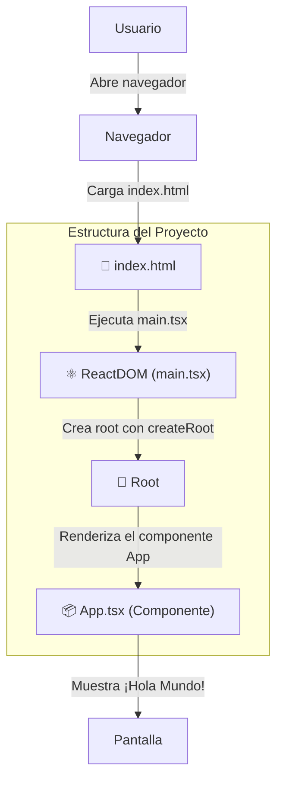

# Hola Mundo
En este primer ejemplo, trabajaremos con los elementos fundamentales de una aplicación React + TypeScript.

___


### **Elementos Básicos**

- **HTML (`index.html`)**  
  - Será el **punto de entrada** de nuestra aplicación.
  - Contendrá un `<div id="root">` donde React inyectará la app.

- **React con TypeScript (`app.tsx`)**  
  - Crearemos nuestro **primer componente funcional** con TypeScript.
  - Aprenderemos a usar **TSX** (JSX con tipado de TypeScript).
  - Renderizaremos el componente con `ReactDOM.createRoot()`.

- **ReactDOM (`main.tsx`)**  
  - Usaremos `createRoot()` para una renderización **más eficiente**.

  - React 19 optimiza el modelo concurrente para **mejor rendimiento**.

___

## **1. HTML (`index.html`)**
```html
<!DOCTYPE html>
<html lang="es">
<head>
    <meta charset="UTF-8">
    <meta name="viewport" content="width=device-width, initial-scale=1.0">
    <title>React 19 - Hola Mundo</title>
</head>
<body>
    <div id="root"></div>
    <script type="module" src="/src/main.tsx"></script>
</body>
</html>
```

**Explicación:**
- **`<div id="root">`**: Es donde React insertará la aplicación.
- **`<script type="module" src="/src/main.tsx">`**: Carga la aplicación React.

___

## **2. React con TypeScript (`app.tsx`)**
```tsx
// Importamos React para usar JSX
import React from "react";

/**
 * Componente principal de la aplicación
 * @returns JSX.Element
 */
const App: React.FC = () => {
    return <h1>¡Hola Mundo desde React 19 con TypeScript!</h1>;
};

export default App;
```

**Explicación:**
- `React.FC` indica que `App` es un **Componente Funcional**.
- Se usa **Arrow Function (`()=>{}`)** en lugar de `function App() {}` porque:
  - Es **más conciso** .
  - No necesita `this` (mejor para eventos y hooks).
  - Se recomienda en **React con TypeScript**.

___

### **NUEVOS CONCEPTOS**

<details>
<summary>¿Qué es un Componente en React?</summary>

- Un componente es una **función** que devuelve **JSX**.
- Es la **unidad básica** de una aplicación en React.

**Ejemplo:**
```tsx
const Componente: React.FC<{ mensaje: string }> = ({ mensaje }) => {
    return <h1>{mensaje}</h1>;
};
```
</details>

<details>
<summary>Comparación: Función Normal vs. Arrow Function</summary>

```tsx
// Componente con función tradicional
function ComponenteFuncion({ nombre }: { nombre: string }) {
    return <h1>¡Hola, {nombre} desde función tradicional!</h1>;
}

// Componente con Arrow Function (Recomendada)
const ComponenteFlecha: React.FC<{ nombre: string }> = ({ nombre }) => {
    return <h1>¡Hola, {nombre} desde Arrow Function!</h1>;
};
```

**¿Cuál usar?**
`**Arrow Function (`()=>{}`)** es la mejor opción porque:
- Código **más limpio** ✨.
- No usa `this` (mejor en eventos y hooks) 🔥.
- Recomendado en **React 19** ✅.

</details>

___

## **3. ReactDOM en React 19 (`main.tsx`)**

```tsx
import React from "react";
import ReactDOM from "react-dom/client";
import App from "./app";

/**
 * Buscamos el elemento con id "root" en el HTML y lo usamos como contenedor de la aplicación
 */
const rootElement = document.getElementById("root");

if (rootElement) {
    const root = ReactDOM.createRoot(rootElement);
    root.render(
        <React.StrictMode>
            <App />
        </React.StrictMode>
    );
} else {
    console.error("No se encontró el elemento con id 'root'");
}
```

**Explicación:**
- **`ReactDOM.createRoot()`** → Reemplaza `ReactDOM.render()` (React 17).
- **Habilita React Concurrente** 🚀 (mejor rendimiento y re-renderizados eficientes).
- **`StrictMode`** ayuda a detectar errores en desarrollo.

___

>### **NUEVOS CONCEPTOS**
><details>
><summary>¿Qué es `React.StrictMode` y por qué lo usamos?</summary>
>
>1. **`<React.StrictMode>`** es un componente especial que **no se renderiza en el DOM**.
>
>2. **Ayuda a detectar problemas en la aplicación antes de que lleguen a producción**.
>
>3. **Ejecuta funciones dos veces en desarrollo** (`useEffect`, `componentDidMount`).
>***Ejemplo de problema detectado***

```tsx
useEffect(() => {
    console.log("Este efecto se ejecuta dos veces en desarrollo");
}, []);
```

></details>

><details>
><summary>¿Qué es `"react-dom/client"` en React 18+ y React 19?</summary>
>
>- `"react-dom/client"` es el nuevo módulo para renderizar aplicaciones en React 18+.
>
>- Antes, se usaba `"react-dom"` y `ReactDOM.render()`.
>
>- Con `createRoot()`, React maneja mejor el **renderizado concurrente**.
></details>

```tsx
// React 17 (obsoleto)
ReactDOM.render(<App />, document.getElementById("root"));

// React 18+ (recomendado)
const root = ReactDOM.createRoot(document.getElementById("root"));
root.render(<App />);
```

---
