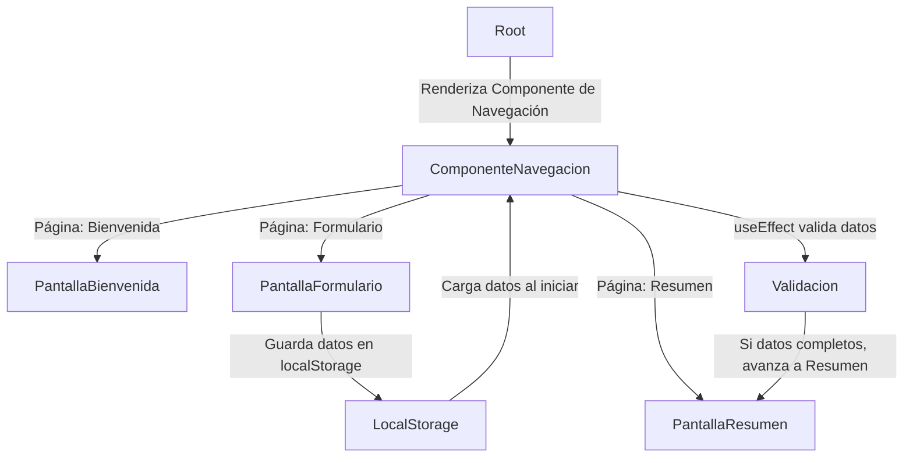

# Navegación, Persistencia y Validaciones Automáticas

- **Cómo manejar navegación entre páginas usando `useState`.**
- **Cómo persistir datos en `localStorage` para que no se pierdan al recargar.**
- **Cómo usar `useEffect` para validar automáticamente los datos antes de avanzar.**

## **Elementos del Proyecto**

- **React con TypeScript (`app.tsx`)**  
  - Creamos un sistema de navegación entre "Bienvenida", "Formulario" y "Resumen".
  - Guardamos datos en `localStorage` y los recuperamos si existen.
  - Validamos automáticamente los datos con `useEffect`.



## **Componente con `useState`, `localStorage` y `useEffect` (`app.tsx`)**

```tsx
import React, { useState, useEffect } from "react";

/**
 * Tipos de datos para el formulario.
 */
type FormularioDatos = {
    nombre: string;
    edad: string;
};

/**
 * Componente que maneja la navegación entre páginas y la persistencia de datos.
 */
const App: React.FC = () => {
    const [pagina, setPagina] = useState<string>("bienvenida");
    const [datos, setDatos] = useState<FormularioDatos>(() => {
        const datosGuardados = localStorage.getItem("formularioDatos");
        return datosGuardados ? JSON.parse(datosGuardados) : { nombre: "", edad: "" };
    });

    // Guardar datos en localStorage cada vez que cambian
    useEffect(() => {
        localStorage.setItem("formularioDatos", JSON.stringify(datos));
    }, [datos]);

    // Validar automáticamente y avanzar si los datos están completos
    useEffect(() => {
        if (datos.nombre && datos.edad && pagina === "formulario") {
            setPagina("resumen");
        }
    }, [datos, pagina]);

    return (
        <div>
            {pagina === "bienvenida" && (
                <>
                    <h1>Bienvenido</h1>
                    <button onClick={() => setPagina("formulario")}>Ir al Formulario</button>
                </>
            )}

            {pagina === "formulario" && (
                <>
                    <h1>Formulario</h1>
                    <input
                        type="text"
                        placeholder="Nombre"
                        value={datos.nombre}
                        onChange={(e) => setDatos({ ...datos, nombre: e.target.value })}
                    />
                    <input
                        type="number"
                        placeholder="Edad"
                        value={datos.edad}
                        onChange={(e) => setDatos({ ...datos, edad: e.target.value })}
                    />
                </>
            )}

            {pagina === "resumen" && (
                <>
                    <h1>Resumen</h1>
                    <p>Nombre: {datos.nombre}</p>
                    <p>Edad: {datos.edad}</p>
                </>
            )}
        </div>
    );
};

export default App;
```

## **Conceptos Claves**

A continuación, se explican cada uno de los conceptos nuevos con un ejemplo práctico.

### **Navegación con `useState`**

Podemos cambiar entre diferentes "páginas" de una aplicación controlando un estado.

**Ejemplo:**

```tsx
const [pagina, setPagina] = useState("inicio");

return (
    <div>
        {pagina === "inicio" && <h1>Inicio</h1>}
        {pagina === "formulario" && <h1>Formulario</h1>}
        <button onClick={() => setPagina("formulario")}>Ir al Formulario</button>
    </div>
);
```

### **Persistencia de Datos con `localStorage`**

Guardamos datos en `localStorage` para que no se pierdan al recargar la página.

**Ejemplo:**

```tsx
useEffect(() => {
    localStorage.setItem("nombreUsuario", nombre);
}, [nombre]); // Guarda "nombre" cada vez que cambia
```

**Recuperar datos al cargar:**

```tsx
const [nombre, setNombre] = useState(() => {
    return localStorage.getItem("nombreUsuario") || "";
});
```

### **`useEffect` para Validaciones Automáticas**

Podemos verificar datos y tomar decisiones sin que el usuario haga clic en un botón.

**Ejemplo:**

```tsx
useEffect(() => {
    if (nombre.length > 3) {
        console.log("Nombre válido");
    }
}, [nombre]); // Se ejecuta cada vez que cambia "nombre"
```

## **Conclusión**

**Usamos `useState` para manejar navegación entre páginas.**  
**Persistimos datos con `localStorage`, evitando pérdidas al recargar.**  
**Validamos automáticamente con `useEffect`, mejorando la experiencia de usuario.**  
**Creamos una navegación fluida sin necesidad de un router.**  

---
