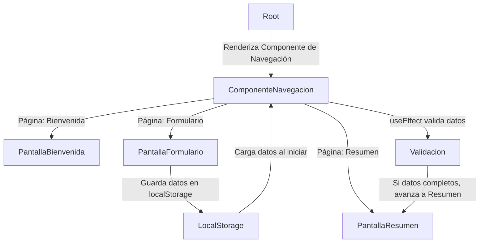

# useEffect, props con API

- **Cómo usar `useEffect` para hacer peticiones a una API externa.**
- **Cómo manejar el estado de carga (`loading`) y errores (`error`).**
- **Cómo utilizar props más avanzadas (`id`, `nombre`, `edad`).**
- **Cómo estructurar mejor la lógica en funciones separadas.**

## **Elementos del Proyecto**

- **React con TypeScript (`app.tsx`)**  
  - Creamos un componente `Usuario` que **recibe props** y **muestra datos dinámicos de una API**.
  - Implementamos `useEffect` para **cargar datos desde una API externa** al montar el componente.
  - Agregamos un botón para **refrescar los datos** obtenidos.

```mermaid
graph TB;
    Root -->|Renderiza el componente Usuario| ComponenteUsuario
    ComponenteUsuario -->|Ejecuta useEffect -carga datos API-| Estado
    Estado -->|Actualiza la pantalla con datos| Pantalla
    Usuario -->|Presiona botón \"Refrescar\"| Refrescar
    Refrescar -->|Vuelve a llamar a la API| Estado
```

## **Componente con `useEffect` para Cargar una API (`app.tsx`)**
```tsx
import React, { useState, useEffect } from "react";

/**
 * Tipo de datos para el usuario.
 */
type UsuarioProps = {
    id: number;
    nombre: string;
    edad: number;
};

/**
 * Componente que muestra información de un usuario y permite refrescar los datos.
 */
const Usuario: React.FC = () => {
    const [usuario, setUsuario] = useState<UsuarioProps | null>(null);
    const [loading, setLoading] = useState<boolean>(true);
    const [error, setError] = useState<string | null>(null);

    // Función para obtener datos de usuario desde una API simulada
    const fetchUsuario = async () => {
        setLoading(true);
        setError(null);

        try {
            const response = await fetch("https://jsonplaceholder.typicode.com/users/1");
            if (!response.ok) throw new Error("Error al cargar los datos");

            const data = await response.json();
            // Simulamos un usuario con datos de la API
            const nuevoUsuario: UsuarioProps = {
                id: data.id,
                nombre: data.name,
                edad: Math.floor(Math.random() * (50 - 18 + 1) + 18), // Edad aleatoria entre 18 y 50
            };
            setUsuario(nuevoUsuario);
        } catch (err) {
            setError("No se pudo obtener la información del usuario.");
        } finally {
            setLoading(false);
        }
    };

    // useEffect para cargar el usuario al montar el componente
    useEffect(() => {
        fetchUsuario();
    }, []);

    return (
        <div>
            <h1>Información del Usuario</h1>
            {loading && <p>Cargando...</p>}
            {error && <p style={{ color: "red" }}>{error}</p>}
            {usuario && (
                <>
                    <p>ID: {usuario.id}</p>
                    <p>Nombre: {usuario.nombre}</p>
                    <p>Edad: {usuario.edad}</p>
                </>
            )}
            <button onClick={fetchUsuario}>Refrescar Usuario</button>
        </div>
    );
};

const App: React.FC = () => {
    return <Usuario />;
};

export default App;
```

## **Conceptos Clave**
A continuación, se explican cada uno de los conceptos nuevos con un ejemplo práctico.

### **Props Avanzadas en React**
Las `props` pueden ser más detalladas con tipos específicos.

**Ejemplo:**

```tsx
type UsuarioProps = {
    id: number;
    nombre: string;
    edad: number;
};

const TarjetaUsuario: React.FC<UsuarioProps> = ({ id, nombre, edad }) => {
    return (
        <div>
            <h3>{nombre}</h3>
            <p>ID: {id} | Edad: {edad}</p>
        </div>
    );
};

const App: React.FC = () => {
    return <TarjetaUsuario id={1} nombre="Carlos" edad={30} />;
};
```

### **`useState` con Datos Dinámicos**

Manejo de estado para almacenar objetos.

**Ejemplo:**

```tsx
const [usuario, setUsuario] = useState<{ nombre: string; edad: number }>({
    nombre: "Ana",
    edad: 25,
});

// Cambiar el estado con un nuevo usuario
setUsuario({ nombre: "Juan", edad: 32 });
```

### **`useEffect` para Llamar a una API**

Ejecutar código al montar un componente.

**Ejemplo:**

```tsx
useEffect(() => {
    fetch("https://jsonplaceholder.typicode.com/users/1")
        .then((res) => res.json())
        .then((data) => console.log(data));
}, []);
```

Se ejecuta **una vez** al montar el componente.

### **Botón para Refrescar Datos (`onClick`)**

Podemos ejecutar una nueva llamada a la API con un botón.

**Ejemplo:**

```tsx
<button onClick={() => fetchUsuario()}>Refrescar Datos</button>
```

**Cada clic carga nuevos datos desde la API.**

### **Conclusión**

**`useEffect` nos permite cargar datos desde una API.**  
**Manejamos el estado con `useState` (`loading`, `error`, `usuario`).**  
**Creamos `props` avanzadas con objetos tipados (`UsuarioProps`).**  
**Evitamos errores en la API con `try/catch` y control de estado.**  
**Creamos un botón para refrescar los datos dinámicamente.**  

---

# Navegación, Persistencia y Validaciones Automáticas

- **Cómo manejar navegación entre páginas usando `useState`.**
- **Cómo persistir datos en `localStorage` para que no se pierdan al recargar.**
- **Cómo usar `useEffect` para validar automáticamente los datos antes de avanzar.**

## **Elementos del Proyecto**

- **React con TypeScript (`app.tsx`)**  
  - Creamos un sistema de navegación entre "Bienvenida", "Formulario" y "Resumen".
  - Guardamos datos en `localStorage` y los recuperamos si existen.
  - Validamos automáticamente los datos con `useEffect`.



## **Componente con `useState`, `localStorage` y `useEffect` (`app.tsx`)**

```tsx
import React, { useState, useEffect } from "react";

/**
 * Tipos de datos para el formulario.
 */
type FormularioDatos = {
    nombre: string;
    edad: string;
};

/**
 * Componente que maneja la navegación entre páginas y la persistencia de datos.
 */
const App: React.FC = () => {
    const [pagina, setPagina] = useState<string>("bienvenida");
    const [datos, setDatos] = useState<FormularioDatos>(() => {
        const datosGuardados = localStorage.getItem("formularioDatos");
        return datosGuardados ? JSON.parse(datosGuardados) : { nombre: "", edad: "" };
    });

    // Guardar datos en localStorage cada vez que cambian
    useEffect(() => {
        localStorage.setItem("formularioDatos", JSON.stringify(datos));
    }, [datos]);

    // Validar automáticamente y avanzar si los datos están completos
    useEffect(() => {
        if (datos.nombre && datos.edad && pagina === "formulario") {
            setPagina("resumen");
        }
    }, [datos, pagina]);

    return (
        <div>
            {pagina === "bienvenida" && (
                <>
                    <h1>Bienvenido</h1>
                    <button onClick={() => setPagina("formulario")}>Ir al Formulario</button>
                </>
            )}

            {pagina === "formulario" && (
                <>
                    <h1>Formulario</h1>
                    <input
                        type="text"
                        placeholder="Nombre"
                        value={datos.nombre}
                        onChange={(e) => setDatos({ ...datos, nombre: e.target.value })}
                    />
                    <input
                        type="number"
                        placeholder="Edad"
                        value={datos.edad}
                        onChange={(e) => setDatos({ ...datos, edad: e.target.value })}
                    />
                </>
            )}

            {pagina === "resumen" && (
                <>
                    <h1>Resumen</h1>
                    <p>Nombre: {datos.nombre}</p>
                    <p>Edad: {datos.edad}</p>
                </>
            )}
        </div>
    );
};

export default App;
```

## **Conceptos Claves**

A continuación, se explican cada uno de los conceptos nuevos con un ejemplo práctico.

### **Navegación con `useState`**

Podemos cambiar entre diferentes "páginas" de una aplicación controlando un estado.

**Ejemplo:**

```tsx
const [pagina, setPagina] = useState("inicio");

return (
    <div>
        {pagina === "inicio" && <h1>Inicio</h1>}
        {pagina === "formulario" && <h1>Formulario</h1>}
        <button onClick={() => setPagina("formulario")}>Ir al Formulario</button>
    </div>
);
```

### **Persistencia de Datos con `localStorage`**

Guardamos datos en `localStorage` para que no se pierdan al recargar la página.

**Ejemplo:**

```tsx
useEffect(() => {
    localStorage.setItem("nombreUsuario", nombre);
}, [nombre]); // Guarda "nombre" cada vez que cambia
```

**Recuperar datos al cargar:**

```tsx
const [nombre, setNombre] = useState(() => {
    return localStorage.getItem("nombreUsuario") || "";
});
```

### **`useEffect` para Validaciones Automáticas**

Podemos verificar datos y tomar decisiones sin que el usuario haga clic en un botón.

**Ejemplo:**

```tsx
useEffect(() => {
    if (nombre.length > 3) {
        console.log("Nombre válido");
    }
}, [nombre]); // Se ejecuta cada vez que cambia "nombre"
```

## **Conclusión**

**Usamos `useState` para manejar navegación entre páginas.**  
**Persistimos datos con `localStorage`, evitando pérdidas al recargar.**  
**Validamos automáticamente con `useEffect`, mejorando la experiencia de usuario.**  
**Creamos una navegación fluida sin necesidad de un router.**  

---
